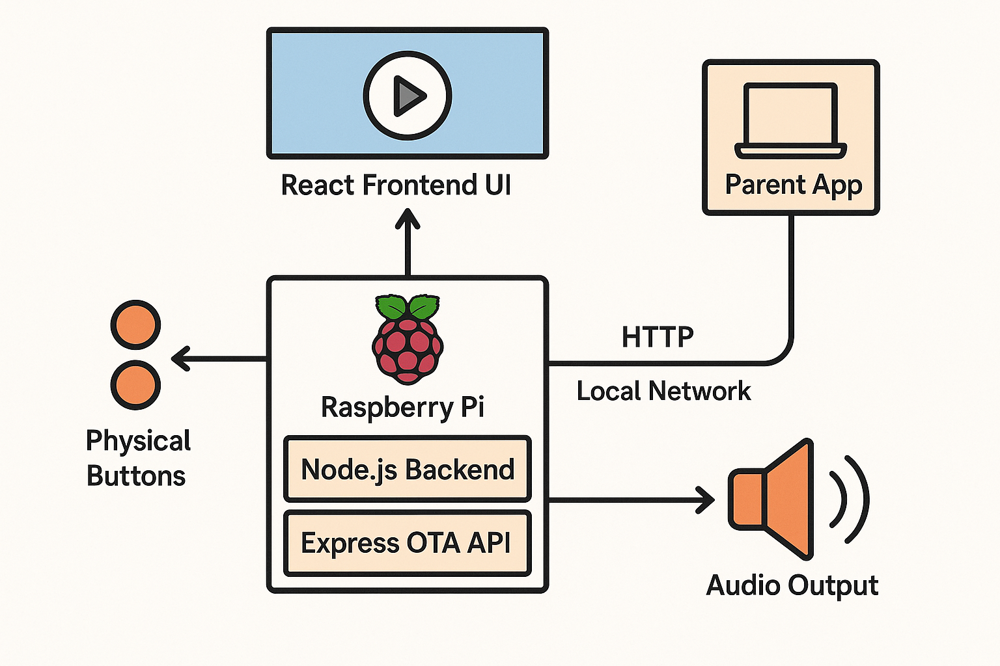

# ARCHITECTURE.md

## Hardware
- Raspberry Pi 4
- 7" touchscreen (official or DSI-compatible)
- Stereo speakers + amplifier
- Buttons: playback, volume, power
- Optional: light sensor, battery pack

## Software Components
- **Frontend**: React UI running in kiosk mode
- **Backend**: Node.js service exposing APIs for playback and OTA
- **OTA Server**: Express API that handles update trigger

## Folder Structure (on Pi)
```
/home/pi/
├── my-app/               # Main app repo
│   ├── frontend/
│   ├── backend/
│   ├── update.sh
│   └── build/            # Frontend production build
├── ota-server/           # Parent app + API server
└── logs/
```


## Diagram

