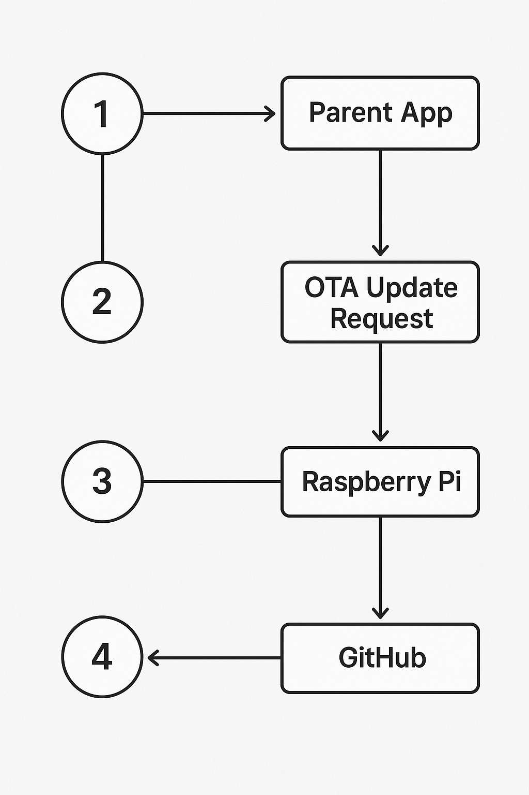

# OTA.md

## Purpose
Allow parent app to trigger software updates (frontend/backend) on the Pi.

## Flow
1. Parent app makes POST request to `/api/update`
2. OTA server authenticates request
3. Runs `update.sh`:
   - Pull latest code from GitHub
   - Install deps
   - Restart services

## Example `update.sh`
```bash
cd /home/pi/my-app || exit 1
git pull origin main || exit 2
npm install --omit=dev
npm run build
pm2 restart all
```

## Security
- Token-based auth in `Authorization` header
- LAN-only access (no open ports)


## Diagram

